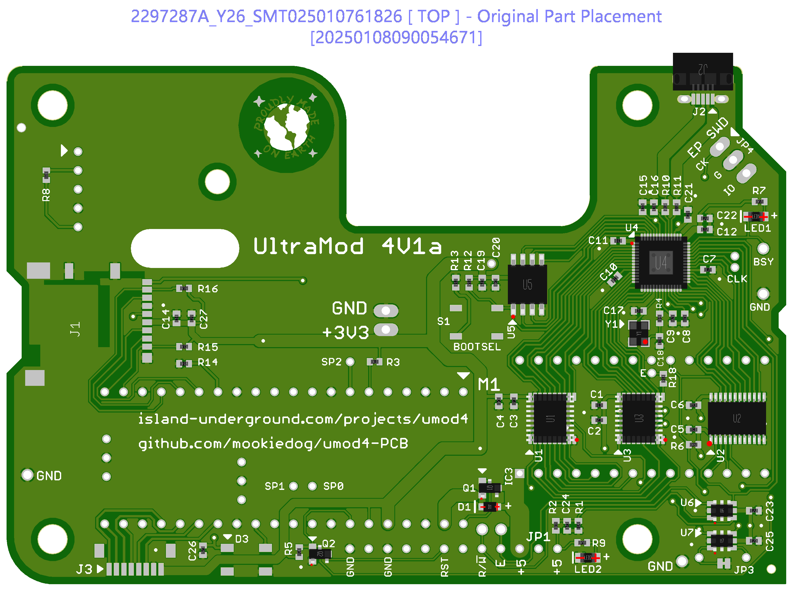
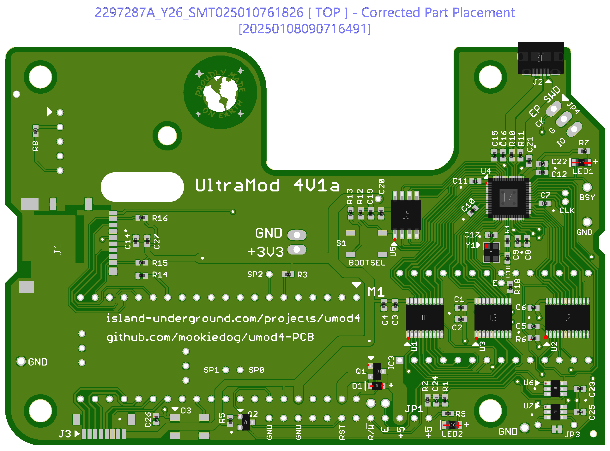

# Ordering From JCLPCB

## Basic Parts Versus Extended

JLCPCB has its own website for parts at https://jlcpcb.com/parts.
That website represents the subset of parts at LCSC.com which are available for use with JLCPCB's assembly service.
When the parts come up after searching, they will indicate whether they are basic or not.
There is also a filter checkbox that restricts the results to basic parts.

## Fabrication Process

### ERC Check

In the schematic editor, run the ERC check. It should only have approved errors and warnings.

### DRC Check

In the board editor, run the DRC check. It should only have approved errors and warnings.

Note that the DRC check __only checks visible layers__. Before running the DRC, make sure that only the following layers are visible:

* Top
* Bottom
* Pads
* Vias
* Unrouted
* Dimension
* tOrigins, bOrigins
* tNames, bNames
* tStop, bStop
* tKeepout, bKeepout
* tRestrict, bRestrict
* Drills
* Holes
* Milling

In particular, make sure that the __tPlace__ and __bPlace__ layers are turned __off__.
If not, there will be a million "Stop Mask" errors where the package outline drawings interfere with the features we really care about.

### CAM Job Processing

Start off by making sure that any old production files are deleted.
Navigate to the main umod4 directory.
Delete all the files inside the 'output' directory.
Do not delete the output directory though.

Start the CAM processor.
Open the file jlcpcb_2_layer_v72.cam located in the main umod4 directory.
This cam file is identical to the jlcpcb cam file except that it sends all the output files to the 'output' directory.

Click the 'Process Job" button.
It will pop up a warning:

    "Package 'AMPHENOL_10118194-0001LF' of element 'J2' contains a polygon that may cause extremely large plot data.
    Continue?"

That is the USB connector where I got a footprint off the web.
The footprint works fine, but for whatever reason, it generates a big data file.
JLCPCB has no problem with it though, so click "Yes to all" to continue.

### Zip File Creation

Once the CAM job completes, there will be a bunch of new files in the main directory.
The cam file creates them according to JCLPCB's naming convention:

* umod4.GBL __Bottom Copper Layer__
* umod4.GBO __Bottom Silkscreen Layer__
* umod4.GBP __Bottom Solder Paste Layer__
* umod4.GBS __Bottom Solder Mask Layer__
* umod4.GKO __Board Outline (also includes internal slots, if any)__
* umod4.GTL __Top Copper Layer__
* umod4.GTO __Top Silkscreen Layer__
* umod4.GTP __Top Solder Paste Layer__
* umod4.GTS __Top Solder Mask Layer__
* umod4.XLN __Drill data file in Excellon format__
* umod4.gpi __General Information__
* umod4.dri __Drill Information__

The only files that JCLPCB needs are the 10 files with the uppercase extensions.
The .gpi and .dri files are strictly informational and not used by the fabrication process.

Create a zip file that contains all 10 files with the uppercase extensions.
Give it a name corresponding to the exact version of the umod4 board, such as umod4v1a.zip.
The zip file is the file that gets sent to JCLPCB. It contains everything required to make the bare printed circuit board.

## BOM and Centroid File Creation

The BOM and centroid files are required for the fabrication process after the PCB itself gets made.

The BOM file is the "Bill of Materials".
It defines what parts are required to fabricate the board.

The centroid file explains where each part listed in the BOM should be placed on the PCB, as well as how to rotate each part after removing it from the parts reel in the pick and place machine before placing it on the PCB.

From the board editor, select 'file/run ULP'. Select 'jlcpcb_smta_exporter_v7.ulp'.

A dialog window will come up.
Make sure you are exporting the Top layer.
Check the checkbox to indicate that you want to skip any part with a missing value.

Click 'OK'.

A save window will pop up asking for a directory to save the files to.
Select the 'output' directory inside the main umod4 directory, then click 'select directory'.

Navigate to the output directory.
There should be two new files:

* umod4_top_bom.csv
* umod4_top_cpl.csv

Verify that the timestamp on these two files match the time they were created, a few seconds ago.
If not, delete those two files, and try again.
Make sure that you do not have either of those excel files open in excel or the export operation silently fails!

Once the bom and cpl files are created properly, you can open them with excel.
If you open the bom file, you will see all the parts. The comment field contains things like the value of a resistor or capacitor, or maybe the generic part number for other things like connectors or ICs.
The most important thing is the column LCSC Part #.
A blank in this column means that the part is _not_ going to be installed as part of the fabrication process.
This may be desirable, if the part is optional for example.

## Triple Check Time!

1) Verify that the timestamp on the uppercase extension files generated by the CAM job are __all__ after the save time on the original schematic and board files

1) Verify that the timestamp on the zip file is after all of the files with the uppercase extensions

1) Verify that the timestamp on the bom and cpl csv files are after the zip file.

## Order At JCLPCB

Use a browser to go to https://www.jlcpcb.com.

If you don't have an account, make one.

Click "Instant Quote".
Drag and drop your zip file containing the PCB design files onto the quote page where it says 'add gerber files'.
It takes a few minutes for jlcpcb to process the zip file.

Verify:
* base material: FR4
* Layers: 2
* Different Design: 1
* Delivery format: Single PCB
* Thickness: 1.6mm
* PCB Color: green
* Silkscreen: White
* Surface finish: HASL (with lead)
* Copper weight: 1 oz
* Via covering: tented
* Min hole size: 0.3mm
* Board Outline Tolerance: Regular
* Confirm Production File: Yes
* Mark on PCB: order number (specify position)
* Electrical Test: Flying probe fully test
* Gold fingers: no
* Castellated holes: no
* Edge plating: no

...and so on.

## Parts Placement Issues

As part of the assembly purchase process, you need to upload your BOM and CPL files.
As soon as you have done that, a file viewer pops up that shows you how your parts will mount on the board.
In theory, all the parts should be drawn exactly where you wanted them, all with the proper rotations.
In practice, this viewer never, *ever* works right for me.
My 4V1 board showed every single part offset by about a quarter of an inch to the left.
In addition, the part rotations were wrong for a significant number of my parts.
It is disconcerting, but the key to success is to check the box that says you want to verify the parts placement before going into production.
With that box checked, keep going through the purchase process.
Another weird thing is that you have to OK the PCB for fabrication before you get a chance to OK the parts placement.
This means that your PCB is in their production queue before the parts placement gets worked out, which could get problematic if there were an issue with the PCB.

But maybe an hour after you OK the PCB and it is in process, you will get another note from a JCLPCB engineer.
You need to back to your order page and click some buttons to see what is going on.
The engineer will have manually checked everything to see how the parts should go on the board.
They will send you two pictures.
One picture shows the 'original' parts placement, before they make any changes.
The second picture shows the changes they have manually made to come up with what they think is the corrected parts placement.
You need to carefully examine the pictures and verify that the results are what you want.

Below, are are the before and after pictures I got from them regarding my 4V1 board.

Interestingly, the 'before' picture (immediately below) is not showing the horizonal offset for all the components like it did on the order webpage.
But clearly, you can see that the orientations are messed up on a few components:

The red dots mark where JCLPCB believes pin 1 to be located.
Y1, U1, U3, U6, U7, Q1, and Q2 have improper orientations.

Here is the showing the parts placement after being processed by the engineer:

Now all the red dots line up with my white pin 1 indicators on the board's silkscreen.
The last thing is to make sure that polarized parts like the LEDs have their + and - connections to the proper ends.
In this case, everything looked fine so I told them to go ahead with production.

It has been my experience that the JCLPCB engineers do a good job at getting the placement correct for production.
I have not had to correct anything after they got through with it.
In fact, there was a time when they found an error on my board where I used the wrong package footprint for one of my parts.
They cancelled the job, I fixed the footprint, resubmitted and everything was fine the second time around.
But is sure is disconcerting to submit payment for boards that look so messed up at the time you order them.
