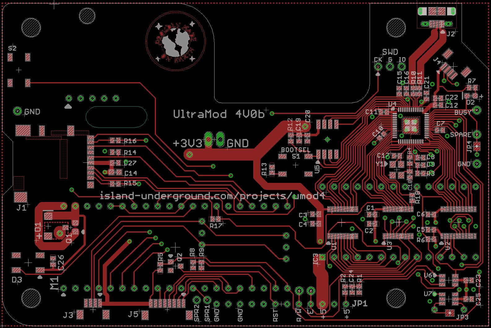

# Umod4PCB

The  (A.K.A umod4) project is a real-time datalogger for Aprila Gen 1 ECUs. It replaces the EPROM in an Aprila Gen 1 ECU with a circuit board that combines realtime ECU datalogging with GPS position and location. The complete project is made up of:

* umod4-PCB: this repository, containing the PCB design files
* [umod4](https://github.com/mookiedog/umod4): the repository containing all the software that runs on the umod4-PCB
* UM4: a special data logging firmware that runs inside the Gen1 ECU, currently a sub-project of the umod4 repository

This view shows a top view of the 4V0b PCB which is the first version to be fabricated so far:

### Status

The first version of the board (marked '4V0b' on its silkscreen) has been fabricated at JCLPCB and tested.
It is functional, with the required workarounds identified [here](ChangeList.md/#v40b-resolved-problems).
The next version of the PCB (tentatively named 4V1) will incorporate
all of the known 4V0b workarounds, plus a number of changes and improvements that have been identified since the 4V0b bring-up process.
I am letting the changes stack up until such time as either some as-yet undiscovered hardware issue with 4V0b forces a new board revision, or I just feel that it is time for a new version to get access to subsequent changes/improvements.
See the file [ChangeList.md](ChangeList.md) for the current set of changes planned for the next PCB revision.

## Goals

### Design For Manufacture

This project uses a bare RP2040 chip to emulate the EPROM in a Gen 1 ECU. The chip is too difficult for me to place by hand for reflowing the board using my [home-brew reflow](https://github.com/mookiedog/Reflow) process. Instead, this PCB is designed for fabrication at JLCPCB.com. Where possible, the BOM parts were chosen from JLCPCB's "basic" component list to avoid the fee for using an "extended" component. Even so, stocks of "basic" parts fluctuate and components become obsolete, so the BOM might change with time.

Once any requirement for hand assembly was eliminated, the door was open to use smaller 0402 components on the PCB.

The initial version of the design (4V0b) has proven it can go end-to-end through the entire JCLPCB fabrication process where the resulting boards function as designed.

### Accessibility

I am not interested in make this project into a product that I would sell and support.
That said, it may be interesting enough for other Aprilia owners out there who have software and/or hardware skills that they might want to replicate the project for their own bike.
I would not recommend building a 4V0b board at this point, just to avoid the workarounds that are already resolved in the next version.
When the next revision of the PCB is sent for manufacture, the required design files will be packaged up into a zip file along with a set of ordering instructions.
The goal would be to enable anyone to order their own manufactured boards directly from JCLPCB.

## Design Tool Choice

Tthe project is currently developed using Cadsoft Eagle.  It's because I've used Eagle for the last bazillion years. I am still using an old version of Eagle (V7.6) that I own outright. These days, you are forced to forced to buy new versions of Eagle on a monthly subscription basis. That doesn't work for me, because I make no money off this stuff and can't afford the subscription fees.  Too bad, I like Eagle.

I realize that at some point it would be worth switching the design over to something like KiCad to make it more accessible to the open source community.

Someday.
