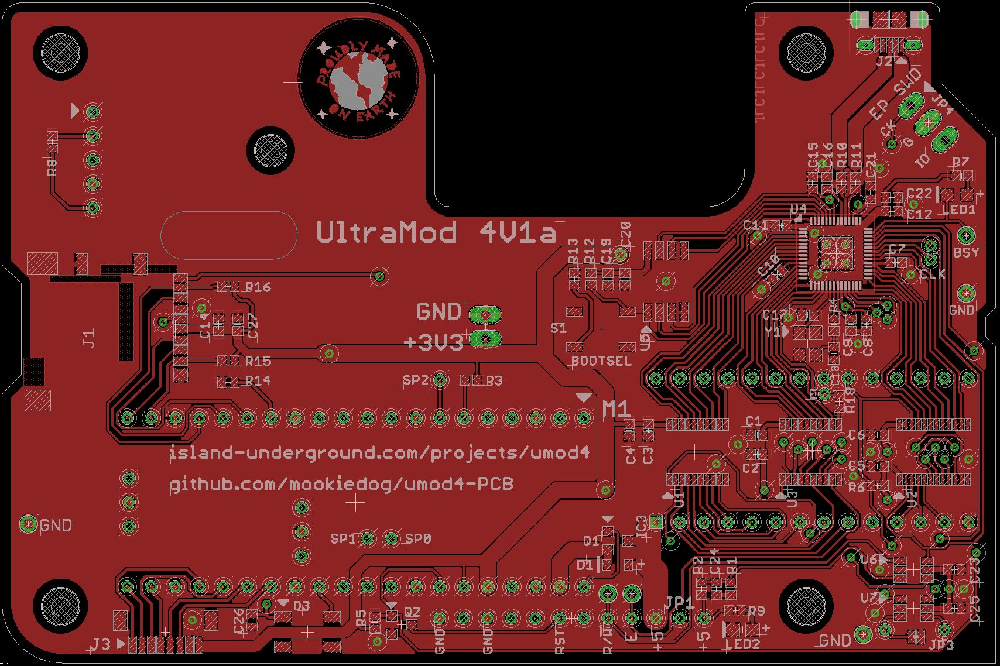
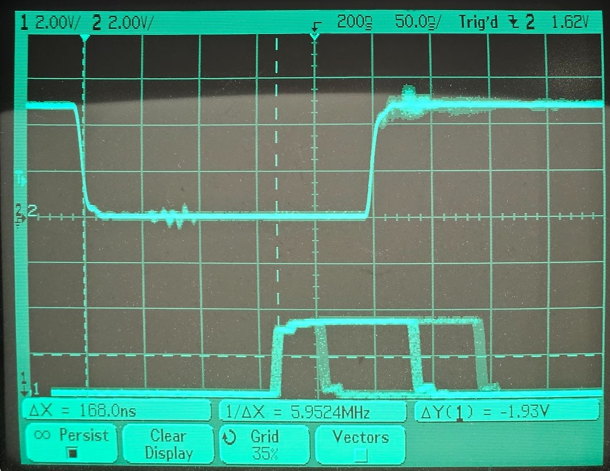

# umod4-PCB

The Ultramod4 (A.K.A [umod4](https://github.com/mookiedog/umod4)) project is a real-time datalogger for Aprila Gen 1 ECUs.
It replaces the EPROM in an Aprila Gen 1 ECU with a circuit board that replaces the EPROM with a fast CPU that emulates an EPROM.
The EPROM emulation CPU's flash contains a special data logging firmware that the ECU will run.
The data-logging firmware is modified to send a real-time stream of ECU data to an interface on the umod4-PCB.
Software running in a daughterboard on the umod4-PCB combines the incoming ECU data stream with real-time GPS location and velocity information.
The combined data stream gets written to a logfile on a micro SD card.

The complete project is made up of:

* [umod4](https://github.com/mookiedog/umod4): the repository containing all the software that runs on the umod4-PCB.
* [UM4](https://github.com/mookiedog/umod4/tree/main/ecu/src): a special data logging firmware that runs inside the Gen1 ECU, currently resides inside the umod4 repository
* umod4-PCB: this repository, containing the PCB design files

The view below shows a top view of the 4V1a PCB, currently the most recent design.
The board's strange shape and cutout are mostly required to access ECU mounting points while avoiding interference with tall components on the ECU itself.

## PCB Status

The first version of the board (marked '4V0b' on its silkscreen) was fabricated at JCLPCB in 2022 and tested.
The second revision, the 4V1a board, was produced by JLCPCB in Jan 2025.
It incorporates all the workarounds from 4V0b, plus a number of changes and enhancements discovered over the last 18 months.
See the file [ChangeList.md](ChangeList.md) for the complete set of changes incorporated by 4V1.

The 4V1 version PCB has passed all its tests so far.
The only outstanding 4V1 feature that has not been tested is the new ability to access the micro SD card using 4-bit mode mode.

## Goals

### Design For Manufacture

This project uses a bare RP2040 chip to emulate the EPROM in a Gen 1 ECU.
The chip is too difficult for me to place by hand for reflowing the board using my [home-brew reflow](https://github.com/mookiedog/Reflow) process.
Instead, this PCB is designed for fabrication at JLCPCB.com.
Where possible, the BOM parts were chosen from JLCPCB's "basic" component list to avoid the fee for using an "extended" component.
Even so, stocks of "basic" parts fluctuate and components become obsolete, so the BOM might change with time to accomodate those changes.

Once any requirement for hand assembly was eliminated, the door was open to use smaller 0402 components on the PCB.

The initial version of the design (4V0b) has proven it can go end-to-end through the entire JCLPCB fabrication process where the resulting boards function as designed.

### Accessibility

I am not interested in making this project into a product that I would sell and support.
That said, it may be interesting enough for other Aprilia owners out there who have software and/or hardware skills that they might want to replicate the project for their own bike.

Who knows, it might be one of those things where a batch of boards gets made from time to time for people who are interested, feel like participating, and know that it is not a product.
Seriously, the last thing on earth that I want is someone sending me a note complaining that I haven't got WiFi working yet.

## Design Tool Choice

The project is currently developed using Cadsoft Eagle version 7.6, the last version I got years ago.
It's because I've used Eagle for the last bazillion years, and I own that old version outright.
These days, you are forced to forced to buy new versions of Eagle on a monthly subscription basis.
That doesn't work for me, because I make no money off this stuff and can't afford the subscription fees.
Too bad, I like Eagle.

I realize that at some point it would be worth switching the design over to something like KiCad to make it more accessible to the open source community.

Someday.

## Project Status

A ton of software exists, and a ton is left to write.

That said, the key to going for a ride though is that the fake EPROM on the circuit board needs to work. And it does!

Below, is a scope shot of the ECU performing memory cycles.
The top trace is the E clock generated by the ECU processor (a MC68HC11 variant).
The bottom trace is generated by the firmware that is pretending to be an EPROM.
The bottom trace goes high when the fake EPROM firmware reads the address and control signals from the HC11 memory bus.

If the memory cycle does not target the EPROM, the firmware drives the lower trace back to zero again very shortly after reading the address and control signal info.

If the memory cycle targets the EPROM with a read operation, the firmware takes a bit more time to access the proper memory byte corresponding to the desired EPROM memory byte, then drive that data onto the memory bus.
The lower scope trace gets driven low again to indicate the time that the read data is available on the memory bus.

Finally, if the memory cycle targets the EPROM with a write, the firmware is required to wait even longer for the write data to finally appear on the bus.
The fake EPROM firmware drives the lower trace back to zero to indicate the exact time that it samples the write data off the HC11 memory bus.

Given that all of these operations are going on all the time, the lower trace has been set up so that it shows examples of the three different operations (ignore, read, write) superimposed on each other:

